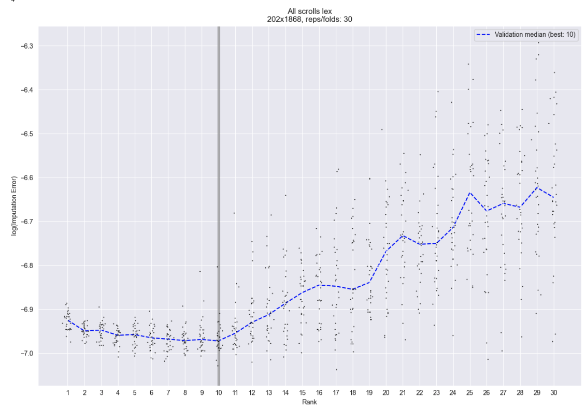
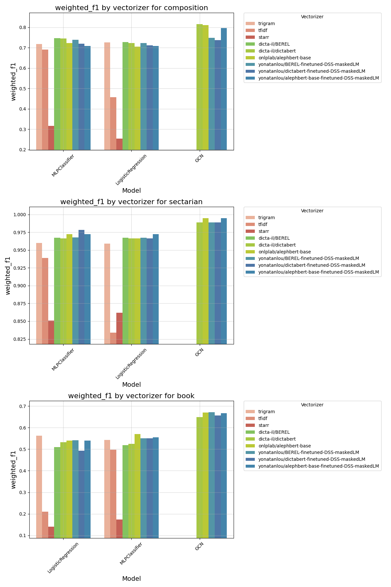
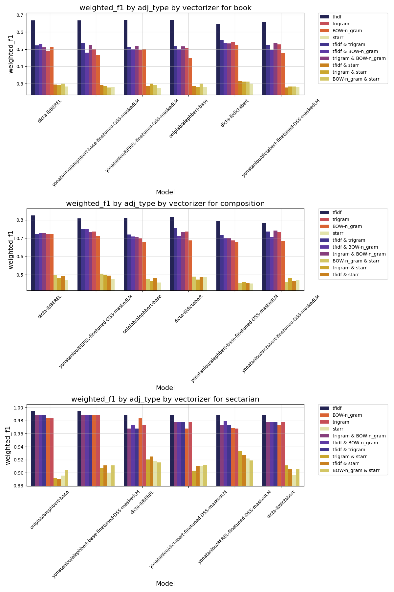

# QumranNLP
## Development
Create a new env (however you want, here a suggestion):
```shell
cd /path/to/cloned/repo
pyenv virtualenv 3.10.0 QumranNLP
pyenv activate QumranNLP
pip install -r requirements.txt
```

## Reproducibility
Reproducibility in the academic workd is pretty sucks. Ive tried to make this whole repo reproducible as much as i can.
If you are reading this, you are probably wish to use the Qumran data, so the data pipelines will be pretty easy to use (`src/ETL/main_ETL.py`).
In case you are here for the machine learning, algorithms or visualizations, Ive tried to make it robust as i can to the data.
In any case, i will post a guide so how to use your own data in the future.


## Data
I'm using the [ETCBC/dss](https://github.com/ETCBC/dss/tree/master) package (built on [text-fabric](https://github.com/annotation/text-fabric/)).
This repo contains the original transcriptions by [Matrin Abegg](https://en.wikipedia.org/wiki/Martin_Abegg) as well (data/texts/abegg).

For generating data, you need to run the `src/main_ETL.py` script.
It will run over all of the scrolls (bib and nonbib), will generate starr features and save two dataframes:
1. Full data (no filtering).
2. Filtered data (you can specify which rules do you want to apply using the `filter_df_by_rules` function). The rules for now are:
   1. Books greater then 300 words.
   2. Hebrew books.
   3. Each book divided into 100 words chunks.


---
## Repo structure

├── data\
├── experiments\
├── models\
├── notebooks\
├── reports\
├── src\

1. Data - contains the most updated processed data (under processed_data), there are also some yamls for the manual tagging of the scrolls (composition and sectarian labels).
2. Experiments - contains the results of multiple experiments.
3. Models - contains some trained models (mainly GNN's, the fine-tuned models are stored in HF).
4. Notebooks - contains alot of research notebooks.
5. Reports - contains the results of most of the experiments.
6. Src - contains the code for the main ETL, feature engineering, experiments, model training.

## Running Research
### Topic modeling
After trying multiple methods for getting the optimal number of topics 
( LDA with coherence and perplexity, NMF optimization by Gal Gilad method, HDP), we decided that the optimal number is somewhere between 10-20.
For now, we will proceed without it.



### Global tuning params
Two different researches for determine the optimal `chunk_size` and the `pre_processing` scheme.
For evaluating each parameter, we checked those scheme on supervised and unsupervised classification for the scroll and composition level.
That means running the `src/ETL/main_ETL.py` for generating data, and then running `make_baselines_results` for each of the tasks (`src/baselines/main.py`).
* Chunk size research: [1.1-select_best_chunk_size.ipynb](notebooks%2F1.1-select_best_chunk_size.ipynb) (code in branch `new-chunking-scheme` )
* Pre processing research: [1.1-select_best_pre_processing_scheme.ipynb](notebooks%2F1.1-select_best_pre_processing_scheme.ipynb) (code in branch `create-pre-processing-schemes-19-08` )

### Fine-tuning
I made the fine-tuning via masked LM scheme with 15% random masking. 
The code was run with colab [fine-tuning-bert-maskedLM.ipynb](https://colab.research.google.com/drive/1N60StbssmT7ssd7ykXP9apKdaVdBa8-7?usp=sharing) for the easy to use GPU 😅. 

### GNN
For implementing different structures in the GNN, ive created a framework which can combine different edge types together (this was implemented before i knew there is a heterogeneous graph implementation in torch-geom).
So each node x is a chunk of text represented by a vector of dimension 768 (from different BERT models).
The edges can constructed via various methods, when the scheme is to define some feature space of the nodes, taking the cosine similiarity between each node, and taking only edges that are most similar (practically zeroing out the <0.99 quantile of the adj matrix)
We can see that for the global tasks (scroll, composition and sectarian classification) the GNN always outperform the rest of the methods.



Interesting to see which types of adjacency matrices perform best:


The unsupervised GNN (GVAE) currently dosent have good results. will update soon.

## Running Tasks:
 

Tasks:

* Clustering at the scroll level:
  * Tried GVAE, but the results were not promising.
  * We can try more unsupervised models and compare them.
  * Another interesting idea is to implement a semi-supervised learning with GVAE with Dasgupta cost. Its interesting because i don't think the dasupta ever been done in deep learning.
----- 
Could be nice in the future:
* Guide on how to use your own data (not Qumran).
* Medium posts:
  * Unsupervised clustering with dasgupta.
  * Easy implementation of GNN with supervised and unsupervised context. 
  * How to use GNN for text classification with different adj matrices.

More optional things to consider:
1. More open questions from Jonathan:
Clustering of Serech Hayachad (חוקים, שירה וכו)
Clustering for CD.
Check if there different מזמורים in Hodayot.
Is Temple Scroll is sectarian?
Compare Instruction and Mysteries.
Compare pesharim and catena florilegium.
